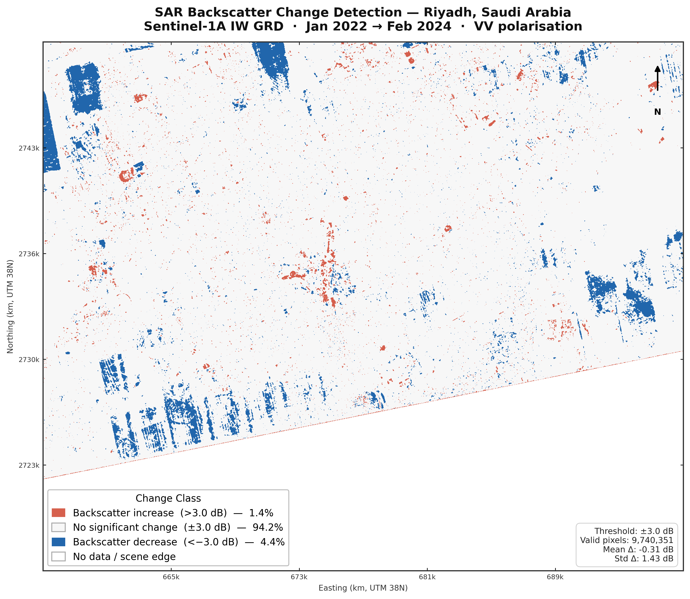
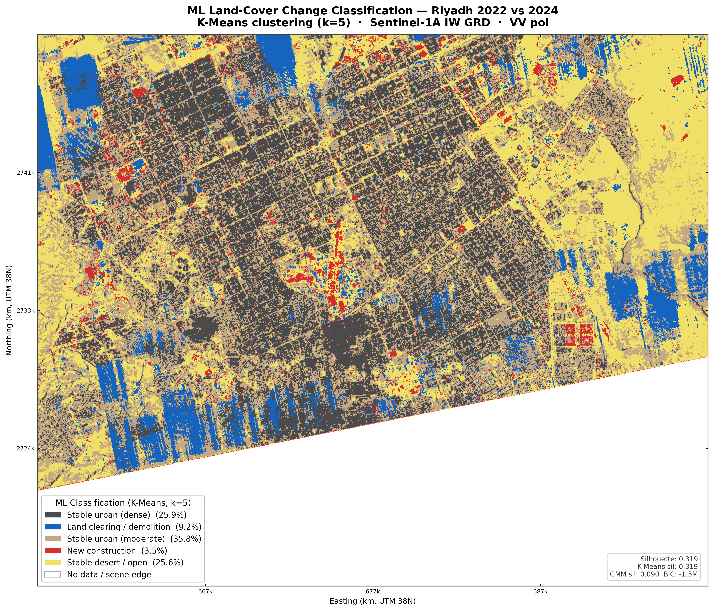

# SAR Change Detection — Riyadh Urban Development (2022–2024)

Automated urban change detection pipeline using Sentinel-1 SAR imagery to map construction, demolition, and land clearing across Riyadh, Saudi Arabia. The project ingests raw Sentinel-1 GRD scenes from Copernicus Dataspace, applies GCP-based georeferencing, speckle filtering, and log-ratio change detection, then classifies change patterns using unsupervised machine learning — producing publication-ready maps, interactive web visualisations, and validation outputs with direct Google Maps cross-referencing.

---

## Key Results

### Change Detection Map


*Red = increased backscatter (new construction). Blue = decreased backscatter (land clearing / demolition). 94.2% of the scene remained stable; 1.4% showed construction activity; 4.4% showed clearing or demolition.*

### ML Land-Cover Classification


*K-Means clustering (k=5) on a 4-band feature stack (dB 2022, dB 2024, |change|, signed change). Silhouette score: 0.319. Classes: dense urban (25.9%), moderate urban (35.8%), desert/open (25.6%), land clearing (9.2%), new construction (3.5%).*

---

## Pipeline Architecture

```
Raw Sentinel-1 GRD (COG)
        |
        v
  GCP Extraction  ──────>  Parse annotation XML for geolocation grid points
        |
        v
  Reprojection    ──────>  Warp via GCPs to UTM Zone 38N (EPSG:32638), 10 m grid
        |
        v
  Speckle Filter  ──────>  Lee filter (7x7 window) on linear amplitude
        |
        v
  dB Conversion   ──────>  10 * log10(amplitude) for radiometric comparison
        |
        v
  Change Detection ─────>  Log-ratio differencing (dB_2024 - dB_2022)
        |                  Threshold classification (+-3 dB)
        v
  ML Classification ────>  K-Means & GMM clustering on 4-band feature stack
        |                  Automated class interpretation
        v
  Validation ───────────>  Connected-component analysis of change clusters
        |                  Google Maps URLs for optical cross-referencing
        v
  Interactive Map ──────>  Folium web map with basemap switching & overlays
```

---

## Validated Findings

Cross-referencing the top change clusters with Google Earth / Maps satellite imagery confirmed:

- **King Salman Park area** (24.83°N, 46.58°E) — largest decrease cluster (496 ha). Massive land clearing and demolition for the 13.4 km² King Salman Park mega-project, visible as widespread backscatter reduction.
- **Northern Riyadh expansion** (24.84°N, 46.69°E) — 383 ha decrease cluster corresponding to new neighbourhood grading and road infrastructure preparation north of the city core.
- **New residential construction** (24.72°N, 46.71°E) — largest increase cluster (33.5 ha). New buildings and structures producing higher radar backscatter where previously open land existed.
- **Southern industrial zone** (24.64°N, 46.64°E) — 274 ha decrease cluster consistent with redevelopment and site preparation in the southern outskirts.

All top-10 cluster locations with Google Maps links are available in [`outputs/06_validation_sites.csv`](outputs/06_validation_sites.csv).

---

## Tech Stack

| Component | Technology |
|-----------|-----------|
| SAR data | Sentinel-1A IW GRD (VV polarisation) |
| Data source | [Copernicus Dataspace](https://dataspace.copernicus.eu) OData API |
| Georeferencing | rasterio + GCP-based warping |
| Speckle filtering | scipy (Lee filter) |
| Change detection | NumPy log-ratio differencing |
| ML classification | scikit-learn (K-Means, GMM) |
| Interactive maps | Folium + Leaflet.js |
| Visualisation | matplotlib |
| Language | Python 3.10 |

---

## Repository Structure

```
sar-change-detection/
├── data/
│   ├── raw/                    # Downloaded Sentinel-1 .SAFE packages
│   └── processed/              # Aligned GeoTIFFs and .npy arrays
├── notebooks/
│   └── 01_preprocessing.ipynb  # Exploratory notebook
├── src/
│   ├── utils.py                # Constants, Lee filter, conversion functions
│   ├── preprocess_v2.py        # GCP parsing, reprojection, speckle filtering
│   ├── change_detect_v2.py     # Log-ratio change detection + visualisation
│   ├── classify.py             # K-Means / GMM classification pipeline
│   ├── validate.py             # Cluster analysis + Google Maps validation
│   └── map_interactive.py      # Folium interactive web map
├── outputs/
│   ├── 02_riyadh_aligned.png   # Preprocessed SAR comparison
│   ├── 03_change_detection.png # Three-panel change map
│   ├── 04_change_histogram.png # Change distribution histogram
│   ├── 05_change_hero.png      # Hero change map (standalone)
│   ├── 06_validation_clusters.png  # Annotated cluster map
│   ├── 06_validation_sites.csv     # Validation sites with Google Maps links
│   ├── 07_ml_classification.png    # ML classified map
│   ├── change_map.tif          # Classified change GeoTIFF
│   ├── change_continuous.tif   # Continuous change GeoTIFF
│   ├── ml_classification.tif   # ML classification GeoTIFF
│   ├── riyadh_change_map.html  # Interactive Folium map
│   └── technical_summary.pdf   # One-page technical summary
└── README.md
```

---

## How to Reproduce

### 1. Environment setup

```bash
conda create -n sarsat python=3.10 gdal rasterio -c conda-forge -y
conda activate sarsat
pip install numpy matplotlib scipy scikit-learn folium reportlab
```

### 2. Download Sentinel-1 data

Download two Sentinel-1A IW GRD COG scenes from [Copernicus Dataspace](https://dataspace.copernicus.eu):

| Scene | Product ID |
|-------|-----------|
| Jan 2022 (before) | `S1A_IW_GRDH_1SDV_20220125T145758_20220125T145823_041619_04F365_5BEC_COG.SAFE` |
| Feb 2024 (after) | `S1A_IW_GRDH_1SDV_20240220T145808_20240220T145833_052644_065E6B_D52C_COG.SAFE` |

Both scenes: ascending pass, relative orbit 72, covering Riyadh (24.55–24.85°N, 46.55–46.95°E).

Place them in `data/raw/`.

### 3. Run the pipeline

```bash
cd sar-change-detection
python src/preprocess_v2.py        # GCP correction, reprojection, speckle filter
python src/change_detect_v2.py     # Log-ratio change detection
python src/validate.py             # Cluster analysis + validation links
python src/classify.py             # ML classification (K-Means + GMM)
python src/map_interactive.py      # Interactive Folium map
```

### 4. View results

- Open `outputs/riyadh_change_map.html` in a browser for the interactive map
- All figures are in `outputs/` at 300 DPI print resolution

---

## Limitations & Future Work

This project demonstrates a practical SAR change detection pipeline using freely available data and open-source tools. Several known limitations constrain the results:

- **No radiometric calibration to sigma-naught (σ⁰).** The pipeline operates on raw amplitude values rather than calibrated backscatter coefficients. While this is sufficient for relative change detection between same-sensor, same-orbit acquisitions, absolute backscatter comparisons across different sensors or orbits would require full radiometric calibration using the Sentinel-1 calibration LUT.
- **No terrain correction.** The GRD products are not corrected for topographic distortion (foreshortening, layover, shadow). Riyadh's flat terrain minimises this effect, but applying Range-Doppler Terrain Correction (e.g. via SNAP or `sarsen`) with a DEM would improve geometric accuracy for hillier AOIs.
- **Seasonal baseline difference.** The before scene (January 2022) and after scene (February 2024) are ~25 months apart with a one-month seasonal offset. Some detected changes — particularly in the "land clearing" class — may reflect seasonal soil moisture or vegetation differences rather than permanent land-cover change.
- **~30% nodata from scene geometry.** Both scenes are from the same relative orbit (72, ascending), but the swath does not fully cover the Riyadh AOI bounding box. Approximately 30% of the output grid contains nodata pixels (scene edges), which are masked in all outputs but reduce the effective analysis area.

**Future improvements** could include: full sigma-naught calibration, terrain correction with SRTM/Copernicus DEM, multi-temporal stacking (>2 dates) to separate seasonal from permanent change, and integration of coherence from SLC products for more sensitive change detection.

---

## Author

**Ahmed** — Electrical Engineer transitioning to Earth Observation and the Space sector. This project demonstrates applied SAR remote sensing skills: radar image processing, geospatial analysis, change detection, and machine learning classification for urban monitoring using freely available Copernicus satellite data.

---

*Data: Copernicus Sentinel-1 (ESA), accessed via Copernicus Dataspace. Contains modified Copernicus Sentinel data [2022, 2024].*
